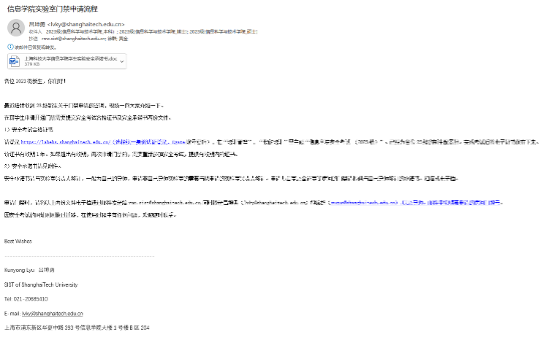
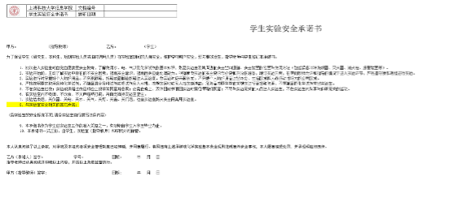
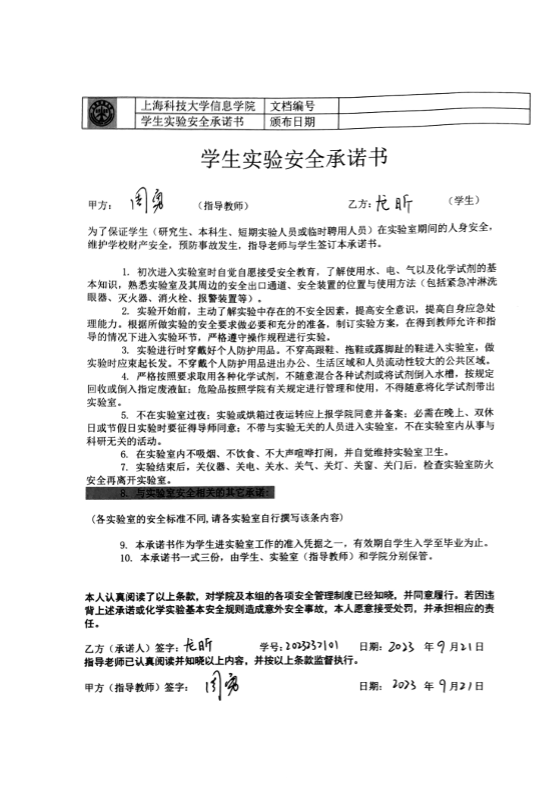
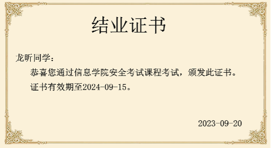
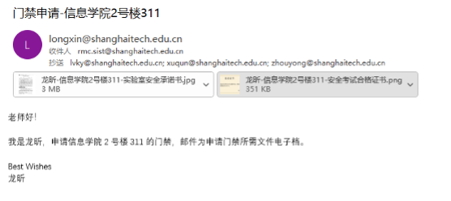

# 上海科技大学门禁申请流程

**注意这是往年流程，今年的流程如果有变化以今年的为准**

1. 查看门禁通知邮件：\
在校园邮箱，应该会收到吕坤勇老师发送的门禁申请流程：

2. 填写“上海科技大学信息学院学生实验安全承诺书.doc” 

填写方法参考

3. 前往 [上海科技大学实验室安全管理系统](https://labehs.shanghaitech.edu.cn) 完成考试并保存证书，证书参考：

4. 将附件发送给 **rmc.sist@shanghaitech.edu.cn**，抄送**lvky@shanghaitech.edu.cn**，**xuqun@shanghaitech.edu.cn**和**shiym@shanghaitech.edu.cn**，参考：

5. 等待回复即可
